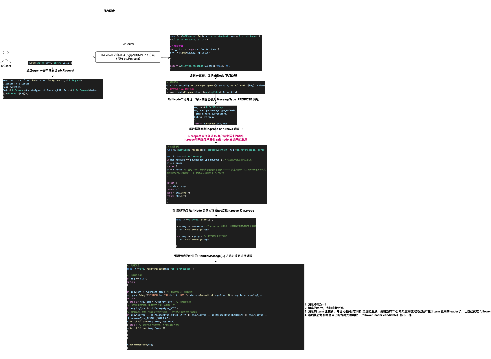
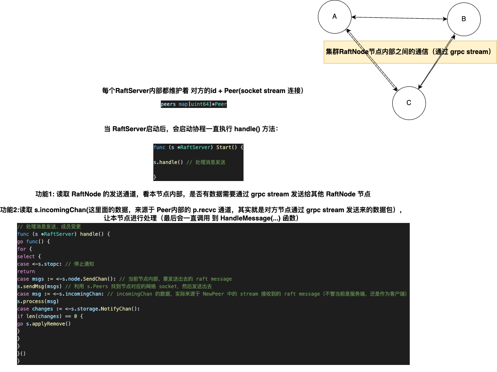
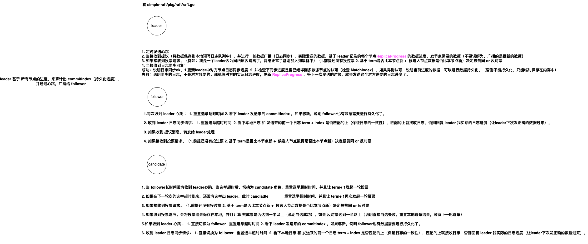

本项目实现了一个简单的分布式kv数据库，共识算法使用Raft，下层存储使用lsm，节点间使用grpc进行通信。

已实现功能：
1. [领导选举](./doc/raft_learn_1.md)
2. [日志同步](./doc/raft_learn_2.md)
3. [日志压缩](./doc/raft_learn_3.md)
4. [成员变更](./doc/raft_learn_4.md)

## Raft 逻辑图

如何作为 键值服务 对外提供功能

集群节点内部如何通信

每个角色的职责：

## 参考

- [In Search of an Understandable Consensus Algorithm](https://raft.github.io/raft.pdf)
- [CONSENSUS: BRIDGING THEORY AND PRACTICE](https://web.stanford.edu/~ouster/cgi-bin/papers/OngaroPhD.pdf)
- [Bigtable: A Distributed Storage System for Structured Data](https://storage.googleapis.com/pub-tools-public-publication-data/pdf/68a74a85e1662fe02ff3967497f31fda7f32225c.pdf)
- [etcd/raft](https://github.com/etcd-io/etcd)
- [leveldb](https://github.com/google/leveldb)
- [goleveldb](https://github.com/syndtr/goleveldb)

    

